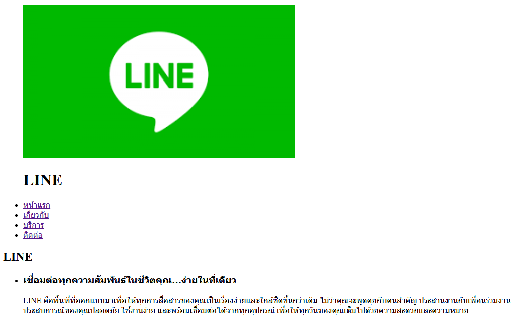
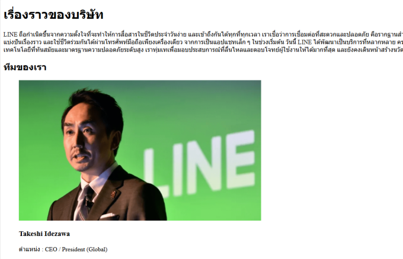
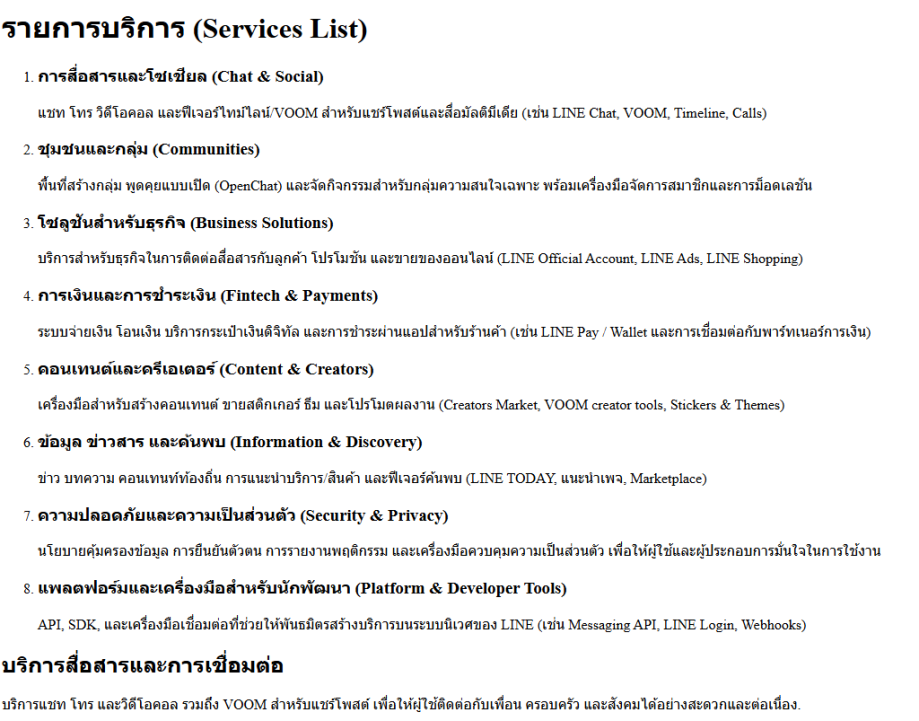
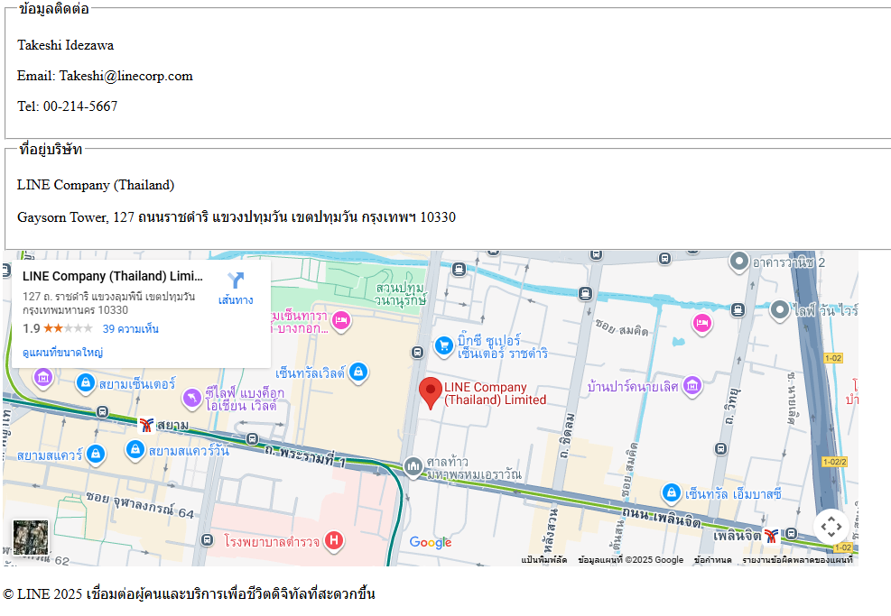

# Create a LINE website

## Project description

- นี่คือการจำลองหน้าเว็บไซต์ของ LINE Company (Thailand) เพื่อใช้เป็นโปรเจกต์ฝึกทักษะ

- สร้างขึ้นเพื่อเรียนรู้การพัฒนาเว็บด้วย HTML พื้นฐาน (ไม่มี CSS/JavaScript)

- เพื่อฝึกการแบ่งโครงสร้างหน้าเว็บ เช่น หน้าแรก เกี่ยวกับ บริการ ติดต่อ

- ข้อมูลบริษัท เนื้อหา เบอร์โทร และแผนที่ เป็น ข้อมูลจำลอง ใช้เพื่อการศึกษาเท่านั้น

- ไฟล์ทั้งหมดสามารถเปิดได้ในเว็บเบราว์เซอร์ทั่วไป

## File structure

- index.html – หน้าแรกของเว็บไซต์ พร้อม Hero section และบริการเด่นของ LINE

- about.html – หน้าเกี่ยวกับบริษัท มีเรื่องราวของ LINE, Mission, Vision และทีมงาน

- services.html – หน้าบริการ แสดงรายละเอียดบริการต่าง ๆ ของ LINE เช่น LINE Chat, LINE OA, LINE Pay

- contact.html – หน้าติดต่อ มีข้อมูลบริษัทจำลอง, อีเมล, เบอร์โทร และแผนที่ Google Maps (ตำแหน่ง LINE Thailand)

- images/ – โฟลเดอร์เก็บภาพที่ใช้ในโปรเจกต์ (โลโก้/สกรีนช็อต)

- README.md – เอกสารอธิบายโปรเจกต์ (ไฟล์นี้)

## All screenshots and links to each page

### 1. หน้าแรก (Home)

[คลิกเพื่อดูหน้าแรก](./index.html)

### 2. หน้าเกี่ยวกับเรา (About)

[คลิกเพื่อดูเกี่ยวกับ](./about.html)

### 3. หน้าบริการ (Services)

[คลิกเพื่อดูบริการ](./services.html)

### 4. หน้าติดต่อ (Contact)

[คลิกเพื่อดูติดต่อ](./contact.html)

