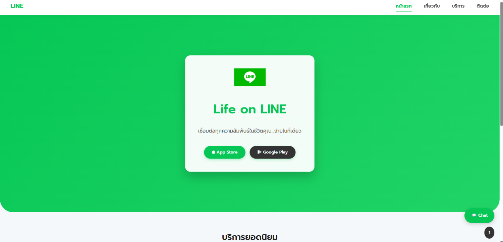
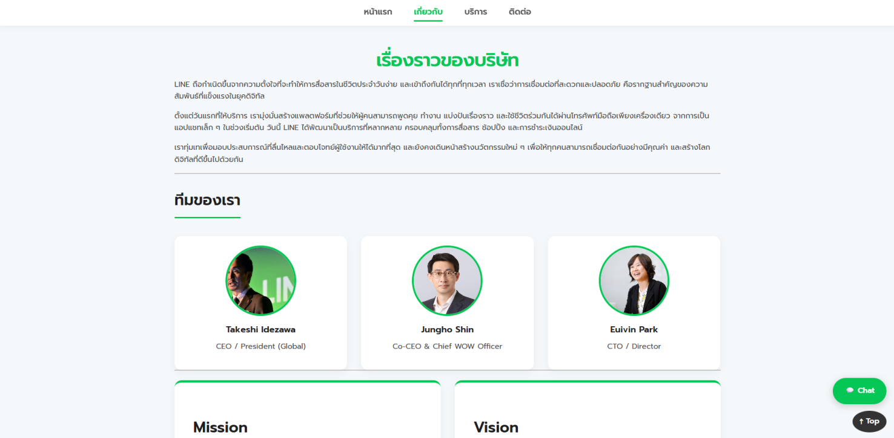
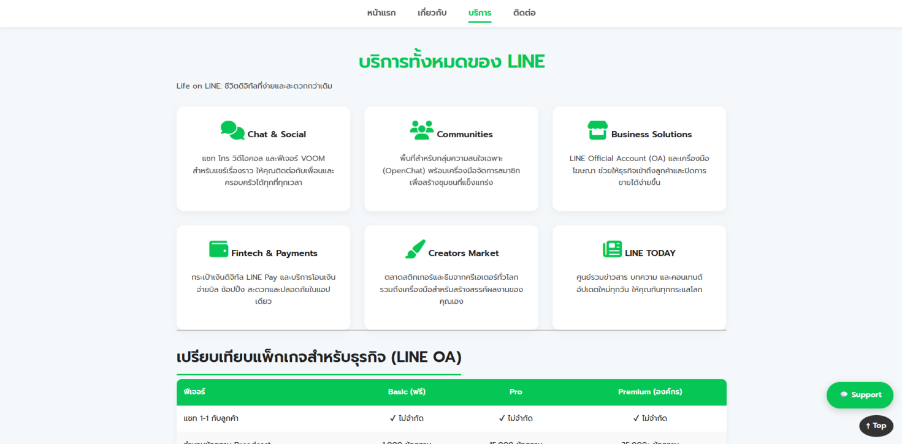
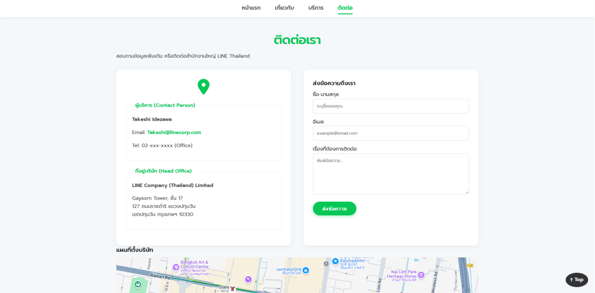

# LINE Company (Thailand) Business Website

## About the Project

This project is a responsive business website redesign for **LINE Company (Thailand)**. It showcases the company's mission "Closing the Distance", detailing its history, digital services, and business solutions. The project demonstrates modern HTML5 and CSS3 techniques, focusing on responsive design, grid layouts, and clean user interfaces using the brand's signature Green theme.

## Website Pages

| Page     | Description                                          | Link                           |
| -------- | ---------------------------------------------------- | ------------------------------ |
| Home     | Hero section with app download buttons & highlights  | [index.html](index.html)       |
| About    | Company story, mission/vision, and executive team    | [about.html](about.html)       |
| Services | Service details and LINE OA pricing comparison table | [services.html](services.html) |
| Contact  | Contact info, form, and Gaysorn Tower location map   | [contact.html](contact.html)   |

## File Structure

```
my-business-web/
├── index.html
├── about.html
├── services.html
├── contact.html
├── css/
│   └── styles.css
├── images/
│   └── ...
└── README.md
```

## CSS Implementation

### Selectors

| Type         | Examples                                  | Usage                                 |
| ------------ | ----------------------------------------- | ------------------------------------- |
| Universal    | `*`                                       | Reset margin, padding, box-sizing     |
| Element      | `body`, `h1`, `h2`, `img`, `a`            | Base typography and responsiveness    |
| Class        | `.container`, `.card`, `.btn`, `.nav-bar` | Reusable components and layout        |
| ID           | `#Header`, `#footer`, `#mission-vision`   | Unique page sections                  |
| Pseudo-class | `:hover`, `:active`, `:nth-child(even)`   | Interactive states and table striping |

### CSS Units

| Unit  | Usage                                              |
| ----- | -------------------------------------------------- |
| `px`  | Borders, box-shadows, fixed spacing                |
| `rem` | Font sizes, margins, paddings (Responsive scaling) |
| `%`   | Container widths, fluid images                     |
| `vh`  | Hero section height (min-height)                   |
| `fr`  | Grid fractions for flexible column layouts         |

### Color Palette

| Color      | Hex Code  | Usage                                  |
| ---------- | --------- | -------------------------------------- |
| LINE Green | `#06C755` | Headers, Primary Buttons, Links, Icons |
| Dark Green | `#05b34c` | Button Hover States                    |
| Black      | `#1E1E1E` | Primary Headings, Footer Background    |
| Light Gray | `#F5F8FA` | Page Background                        |
| White      | `#ffffff` | Cards, Navbar, Content Areas           |

### Typography

- **Font Family:** "Prompt", "Segoe UI", Tahoma, sans-serif
- **Font Weights:** 400 (regular), 600 (semi-bold), 700 (bold)
- **Line Height:** 1.6 (readability)
- **Text Effects:** `text-align: center` (Headings), `text-shadow` (Hero section)

### Box Model

- **Padding:** Used for inner spacing in cards, buttons, and sections
- **Margin:** Spacing between sections and elements
- **Border:** Input fields, table cells, team images (Green border)
- **Border-radius:** Rounded corners (15px for cards, 30px for buttons)

### Positioning & Layout

| Property             | Usage                              |
| -------------------- | ---------------------------------- |
| `position: sticky`   | Navigation bar stays at top        |
| `position: fixed`    | Back-to-top button and Chat widget |
| `position: absolute` | Overlay elements (if used)         |
| `position: relative` | Parent container for Hero section  |

### Display & Layout Systems

| System                  | Usage                                              |
| ----------------------- | -------------------------------------------------- |
| `display: flex`         | Navigation menu, contact form layout, footer       |
| `display: grid`         | Services grid (Cards), Team grid, Mission/Vision   |
| `grid-template-columns` | `repeat(auto-fit, minmax(...))` for responsiveness |
| `justify-content`       | Centering navigation items                         |
| `gap`                   | Spacing between grid/flex items                    |

### Hover & Interaction Effects

| Effect           | CSS Properties                                             |
| ---------------- | ---------------------------------------------------------- |
| Button hover     | Color change, `transform: scale(1.05)`, shadow             |
| Card/Image hover | `transform: translateY(-10px)`, `box-shadow` (Glow effect) |
| Link active      | `border-bottom` highlight for current page                 |
| Animations       | Keyframes `@slideInUp` for Hero text load                  |
| Smooth Scroll    | `scroll-behavior: smooth` for "Top" button                 |

### Responsive Design

| Breakpoint         | Changes                                               |
| ------------------ | ----------------------------------------------------- |
| `Max-width: 600px` | Stack navigation, single column grids, adjust padding |
| Mobile View        | Adjust font sizes, vertical layouts for contact form  |

---

## Screenshots

_(Place your screenshots in the 'images' folder and update paths below)_

### Home Page



### About Page



### Services Page



### Contact Page



---

© 2025 LINE Company (Thailand). All rights reserved.
